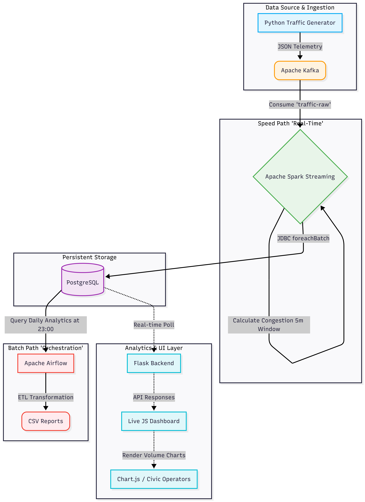
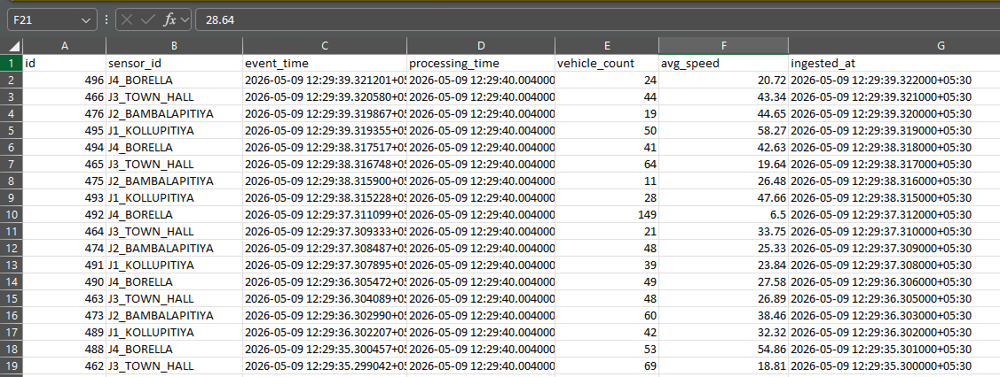
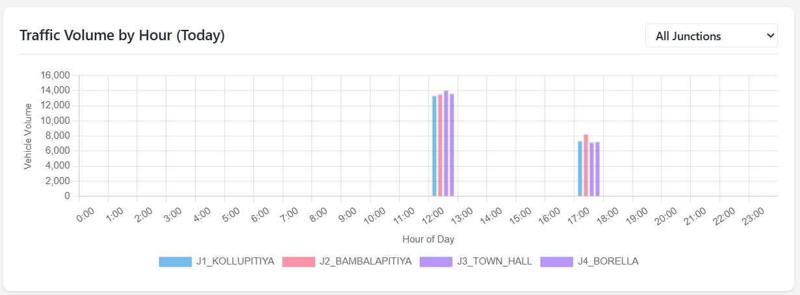

# EC8207 Mini Project Report

## Smart City Traffic & Congestion Pipeline

**Student Names:**
Jayaweera S. T. - EG/2020/3998 |
Gunathilake A. P. B. - EG/2020/3947 |
Madhushan K. K. S. - EG/2020/4356

**Date:** 2026-05-09

---

## 1 INTRODUCTION

This project implements a comprehensive Smart City Traffic management pipeline following a Lambda architecture pattern that combines real-time stream processing with scheduled batch analytics. The system monitors vehicle volumes and speeds in real-time across multiple city junctions, detecting critical traffic jams while maintaining accurate historical aggregations to guide daily police deployments.

The pipeline architecture includes:

- **Ingestion Layer:** Python traffic generator producing realistic IoT sensor telemetry.
- **Streaming Layer:** Apache Kafka for high-throughput event distribution; Apache Spark Structured Streaming for real-time congestion indexing and critical alert generation (speed < 10 km/h).
- **Real-Time Alerts & UI:** Immediate flagging of critical conditions to PostgreSQL, surfaced instantaneously on a Live JavaScript Dashboard.
- **Batch Processing Layer:** Apache Airflow orchestrating scheduled ETL jobs nightly to extract, aggregate, and warehouse traffic patterns.
- **Analytics Layer:** CSV-based data exports featuring Traffic Volume by Hour charts and Police Deployment Strategies.

This report documents the complete architecture, technology justifications, event-time handling semantics, batch orchestration, and the ethical data governance considerations required for a production-grade civic monitoring system.

---

## 2 SYSTEM OVERVIEW & ARCHITECTURE

The traffic monitoring pipeline implements a Lambda architecture combining real-time and batch processing paths:

<!--  -->
<div align="center">

</div>

**Architecture Components:**

- **Data Source Layer:** Traffic generator simulating sensors from 4 junctions, producing JSON records with fields: `sensor_id`, `event_time`, `vehicle_count`, `avg_speed`.
- **Event Ingestion Layer:** Apache Kafka distributes incoming telemetry across the `traffic-raw` topic, enabling resilient data buffering and decoupling.
- **Stream Processing Layer (Speed Path):** Apache Spark Structured Streaming applies windowed calculations and filters with event-time awareness and watermarking (10-minute lateness tolerance). It calculates a Congestion Index over 5-minute tumbling windows and traps sudden speed drops.
- **Real-Time Persistence Layer:** Streaming outputs are written to PostgreSQL (`sensor_readings`, `critical_alerts`, and `congestion_windows`) via JDBC `foreachBatch` operations.
- **Live Dashboard Layer:** A Flask-backed Node/JS dashboard queries PostgreSQL to render live metrics, alerts, and interactive Chart.js graphs mapping traffic volume vs. time of day.
- **Batch Processing Layer (Batch Path):** Apache Airflow orchestrates a scheduled DAG (`traffic_report_dag.py`) running nightly at 23:00 to query the database, ensuring zero-loss end-of-day analytics.
- **Analytics Storage Layer:** Exported static CSV files placed in the `reports/` folder format the insights for urban planners and traffic management operators.

---

## 3 TOOLS & TECHNOLOGIES JUSTIFICATION

- **Apache Kafka:** Enables high-throughput ingestion of granular IoT data. Topic partitioning distributes the load, while persistent offset tracking guarantees no sensor readings are lost even during downstream maintenance.
- **Apache Spark Structured Streaming:** Chosen over native Storm or Flink due to its unified batch and stream API. Windowing natively supports temporal aggregations (e.g., "5-minute block averages"), while micro-batching provides robust exactly-once semantics.
- **PostgreSQL:** Relational databases natively accommodate time-series grouping via `TIMESTAMPTZ` data types. It concurrently supports heavy streaming inserts and dynamic dashboard read queries.
- **Apache Airflow:** Orchestrates end-of-day reports systematically. The DAG structure with automatic retry configurations guarantees analytical reports are dependably generated even if temporary network failures occur.
- **JavaScript/Chart.js & Flask:** Provides an immediately understandable visual interface for civic authorities to monitor traffic spikes and police deployment rankings without writing SQL.

---

## 4 REAL-TIME STREAM PROCESSING LOGIC

Two core processing schemas operate with event-time awareness:

- **Rule 1 - Critical Anomalies (Alerts):** Any sensor reporting an average speed below 10.0 km/h triggers an immediate critical alert route to PostgreSQL.

```python
alerts = parsed.filter(col("avg_speed") < lit(10.0)).select(
    col("sensor_id"), col("event_time"), col("vehicle_count"), col("avg_speed")
)
```

- **Rule 2 - Congestion Indexation (Metrics):** Rolling 5-minute tumbling windows group traffic to generate a structural Congestion Index: `max(0, (vc/150) * (1 - speed/60))`.

```python
windowed = parsed \
    .withWatermark("event_time", "10 minutes") \
    .groupBy(col("sensor_id"), window(col("event_time"), "5 minutes")) \
    .agg(...)
```

---

## 5 EVENT TIME VS. PROCESSING TIME

- **Event Time:** When the sensor actually captured the traffic reading (`timestamp` payload).
- **Processing Time:** When Spark receives and computes the message.

This distinction is critical for accurate traffic mapping. Example: A severe traffic jam occurs at J1_KOLLUPITIYA at 17:00 UTC during monsoon rain. A local network outage delays the sensor transmission, and Spark receives the data at 17:15 UTC.

Using _processing time_ would artificially record the traffic jam at 17:15, ruining urban planning metrics. By strictly processing via _event time_ backed by a 10-minute watermark (`.withWatermark("event_time", "10 minutes")`), Spark inherently corrects the delay and assigns the congestion to the correct 17:00 analytical window.

---

## 6 BATCH PROCESSING & ORCHESTRATION

Scheduled batch jobs every night (23:00) extract and store traffic data. The Airflow DAG pipeline executes:

1.  **Extract:** Queries `traffic_db` restricting purely to `CURRENT_DATE`.
2.  **Transform:** Sorts anomalies chronically and organizes schema layouts.
3.  **Load:** Iterates dynamically over `sensor_readings`, `critical_alerts`, and `congestion_windows` tables, saving data directly into persistent CSV files.

**Nightly Outputs:**
`reports/sensor_readings_YYYY-MM-DD.csv`
`reports/congestion_windows_YYYY-MM-DD.csv`
`reports/critical_alerts_YYYY-MM-DD.csv`



---

## 7 ANALYTICS & REPORTING OUTPUT

The pipeline generates multi-tier analytic transparency:



**Real-Time Dashboard (Visual Analytics):**

- Live scrolling feed of intersection metrics.
- Blinking localized alerts highlighting exact junctions suffering sub-10km/h collapses.
- **Traffic Volume by Hour:** Bar chart (Chart.js) aggregating the real-time sum of vehicles mapped explicitly against the hour of the day.

**Police Deployment Strategy (Reconciliation):**
A calculated daily score combining Peak Volume, Average Speed, and Critical Alerts thresholds.

- `deployment_score = volume * (1/speed) * (1 + alerts)`
- Junctions scoring `> 6.0` actively ping a visual **"DEPLOY POLICE"** notification, optimizing severely limited municipal policing resources reliably.

---

## 8 ETHICS & DATA GOVERNANCE

Civic telemetry requires balancing urban optimization with strict public privacy guarantees.

- **Privacy Risks:** While our current sensors capture aggregate macro-data (counts/speeds), tracking junction loads can structurally map citizen neighborhood egress routines.
- **Data Governance Safeguards:**
  - **Data Minimization:** No license plates (ANPR) or Mac-address tracking are ingested.
  - **Retention Limits:** Raw `sensor_readings` must be purged via database TTL after 30 days, storing only the high-level `congestion_windows` analytically.
  - **Access Control:** Read-only PostgreSQL roles explicitly limit the Live Dashboard's surface area, preventing malicious traffic injection.
- **Algorithm Bias & Fair Enforcement:** The "Police Deployment Algorithm" scores purely upon congestion thresholds. Poorer neighborhoods often feature deteriorated infrastructure causing inherently slower traffic. Blindly linking police deployment to "slow traffic" drastically risks systemic over-policing in neglected areas compared to wealthy districts with modern roads. Deployment metrics must therefore only guide _traffic management personnel_, not strictly armed law enforcement.

---

## 9 CONCLUSION

The Smart City Traffic Pipeline successfully establishes a robust Lambda architecture handling real-time vehicular telemetry alongside deep batch analytics. By properly separating the Speed Path (Spark filtering Kafka inputs instantaneously for critical drops in speed) and the Batch Path (Airflow orchestrating daily CSV extraction), the solution grants city administrators unprecedented immediate visibility and dependable historical reporting. The strict integration of event-time semantics ensures deterministic accuracy despite real-world network fluctuations. Accompanied by vital privacy thresholds and bias documentation, this ecosystem acts as a scalable bedrock for modernized civic infrastructure.
